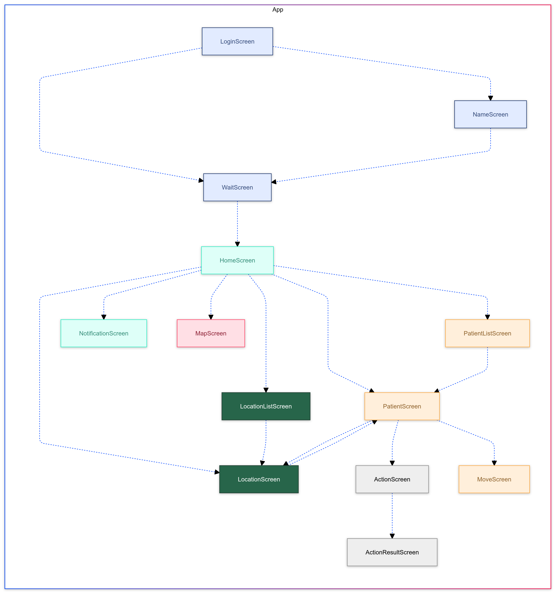
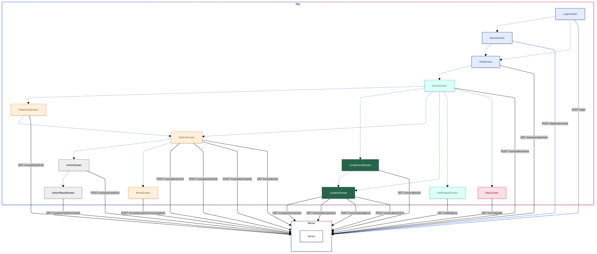

# MANVSim Flutter App

The flutter app is a mobile application for Android, iOS and web.
It is used by the participants of the MANV Simulation to take part in the simulation.


## Contents
<!-- TOC -->
* [MANVSim Flutter App](#manvsim-flutter-app)
  * [Contents](#contents)
  * [Development](#development)
    * [Install and setup Flutter SDK](#install-and-setup-flutter-sdk)
    * [Configuration](#configuration)
    * [Server Environment](#server-environment)
    * [General Remarks](#general-remarks)
  * [Structure](#structure)
    * [App Directory](#app-directory)
    * [Lib Directory](#lib-directory)
    * [Widgets Directory](#widgets-directory)
  * [Screen flow](#screen-flow)
  * [l10n](#l10n)
    * [Example](#example)
    * [Code Usage](#code-usage)
  * [API](#api)
    * [library](#library)
    * [API calls](#api-calls)
  * [Map](#map)
<!-- TOC -->

## Development

The App is developed in the [Flutter](https://docs.flutter.dev/get-started/install) framework for easy multiplatform
development. To build the app, Flutter Version 3.24.1 and Dart Version 3.5.1 are required.

For production deployment follow the [deployment documentation](../deployment/README.md).

### Install and setup Flutter SDK

Follow [this guide ](https://docs.flutter.dev/get-started/install) to install the Flutter SDK and set up your IDE.

Flutters programming language is [Dart](https://dart.dev/overview).
We want to build the application for Android, iOS and web.

For development we recommend [Android Studio or IntelliJ](https://docs.flutter.dev/tools/android-studio).  
For development with VSCode see [Flutter in VSCode](https://docs.flutter.dev/tools/vs-code).

### Configuration

For the local development, the app can be configured with the [config.yaml](../../app/assets/config/config.json) file.

Please note that for deployments with docker compose this file is overwritten by the
[config/app/config.json](../../config/app/config.json) file as described in the 
[deployment documentation](../deployment/README.md#app-1).

The following configuration options are available:

| Variable              | Description                                                                                                                                    | default               |
|-----------------------|------------------------------------------------------------------------------------------------------------------------------------------------|-----------------------|
| apiUrl                | The default API URL. Can be overridden by the user or through an QR code on the login screen. Should be set to localhost for local development | https://localhost/api |
| showMap               | Show the map in the app.                                                                                                                       | true                  |
| showPatientList       | Show the patient list in the app.                                                                                                              | true                  |
| showLocationList      | Show the location list in the app.                                                                                                             | true                  |
| waitScreenIsSkippable | Allow the user to skip the wait screen. Useful to allow this for local development                                                             | false                 |

### Server Environment

For local development and debugging, at least a current server instance is required. Instructions how to easily set up a server
instance can be found in the [deployment documentation](../deployment/README.md#quickstart).

### General Remarks

- The iOS app can only be built on macOS.
- Building the android app requires the Android SDK and a JDK to be installed. To be compatible with the used gradle
  version, the JDK version should be 19.

## Structure

A general overview of the app structure is the following:

```
app/
├── api             # API library
├── assets          # Images and configuration files
├── lib             # Source code
│   ├── main.dart           # Main entry point of the app
│   ├── appframe.dart       # Main frame of the app
│   ├── start_screen.dart   # Start screen of the app, waits 
│   ├── constants/          # Contains constants, icons, and localization files (l10n)
│   ├── models/             # Data models of the app
│   ├── services/           # Services used by the app
│   ├── utils/              # Utility functions
│   └── widgets/            # Widgets and screens of the app
│       ├── action/             # Widgets and screens for performing actions on patients    
│       ├── base/               # Base widgets and screens used in multiple places
│       ├── location/           # Widgets and screens for location interaction
│       ├── map/                # Map screens and widgets
│       ├── media/              # Media widgets and screens for multimedia data types
│       ├── patient/            # Widgets and screens for patient interaction
│       ├── player/             # Widgets and screens for login flow
│       └── util/               # Utility widgets and screens
├── ios             # iOS-specific files
├── android         # Android-specific files
└── web             # Web-specific files

```


More details on the directories can be found in the following tables.

### App Directory

| Path          | Description                                                                                    |
|---------------|------------------------------------------------------------------------------------------------|
| `app/api`     | API library. Automatically generated from openAPI Spec. For more details see [API](#api)       |
| `app/assets`  | assets directory. Contains images and config. More details see [Configuration](#configuration) |
| `app/lib`     | Source code directory. More details in next section [Lib directory](#lib-directory)            |
| `app/ios`     | iOS-specific files                                                                             |
| `app/android` | Android-specific files                                                                         |
| `app/web`     | Web-specific files                                                                             |

### Lib Directory

| Path                        | Description                                                                                                                                                                                                                               |
|-----------------------------|-------------------------------------------------------------------------------------------------------------------------------------------------------------------------------------------------------------------------------------------|
| `app/lib/main.dart`         | Main entry point of the app                                                                                                                                                                                                               |
| `app/lib/appframe.dart`     | Main frame of the app. Visible after login flow is completed.                                                                                                                                                                             |
| `app/lib/start_screen.dart` | Start screen of the app. Only used for forwarding to the correct screen on refresh or first login. If the user is already logged in, the appframe is shown. Otherwise  the app begins with the login flow.                                |
| `app/lib/constants`         | Contains constants, icons, and localization files (l10n). Frequently used icons should be placed in [manv_icons.dart](../../app/lib/constants/manv_icons.dart). For more details on localization see [l10n](#l10n)                        |
| `app/lib/models`            | Data models of the app. Contains function to convert from DTO Objects generated by the API library. May need to be adjusted if the API changes. The [tan_user.dart](../../app/lib/models/tan_user.dart) stores and reloads the user data. |
| `app/lib/services`          | Services used by screens and widgets. The name indicates the corresponding screen or widget.                                                                                                                                              |
| `app/lib/utils`             | Utility functions                                                                                                                                                                                                                         |
| `app/lib/widgets`           | Widgets and screens of the app. More details in the next section [Widgets Directory](#widgets-directory)                                                                                                                                  |

### Widgets Directory

| Path                       | Description                                                      |
|----------------------------|------------------------------------------------------------------|
| `app/lib/widgets/action`   | Widgets and screens to perform actions on patients               |
| `app/lib/widgets/base`     | Base widgets and screens used in multiple places                 |
| `app/lib/widgets/location` | Widgets and screens for location interaction                     |
| `app/lib/widgets/map`      | Map screens and widgets                                          |
| `app/lib/widgets/media`    | Media widgets and screens for multimedia data types              |
| `app/lib/widgets/patient`  | Widgets and screens for patient interaction                      |
| `app/lib/widgets/player`   | Widgets and screens for login flow                               |
| `app/lib/widgets/util`     | Utility widgets and screens                                      |


## Screen flow

The app has the following screen flow:



## l10n

The app is currently localized in German only. The localization files are located in the `app/lib/constants/l10n` directory.
The localization is done with the [flutter internationalization](https://docs.flutter.dev/ui/accessibility-and-internationalization/internationalization) package.
The localization configuration can be found in [l10n.yaml](../../app/l10n.yaml).
All strings that are displayed in the app are localized in the `app/lib/constants/l10n` directory in .arb files.

### Example

The [de arb file](../../app/lib/constants/l10n/de.arb) contains the following content:

```json
{
  "homeScreenName": "Home"
}
```

### Code Usage

Import the localization file:
```dart
import 'package:flutter_gen/gen_l10n/app_localizations.dart';
```

Then use the localization in the code like this:
```dart
AppLocalizations.of(context)!.homeScreenName
```

## API

### library

This app uses an API library automatically generated from the [OpenApi Specification](https://swagger.io/specification/)
in [doc/server/api_game/api.yaml](../server/api_game/api.yaml).  

To regenerate this library (e.g. after changes) run `generate.sh` in [app/api/](../../app/api/).

### API calls

The following diagram shows the flow of API calls from the app to the server:



## Map

For more notes on the map see [Map Notes](map.md).
